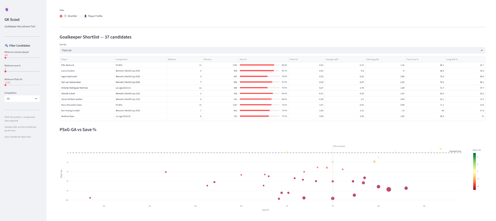
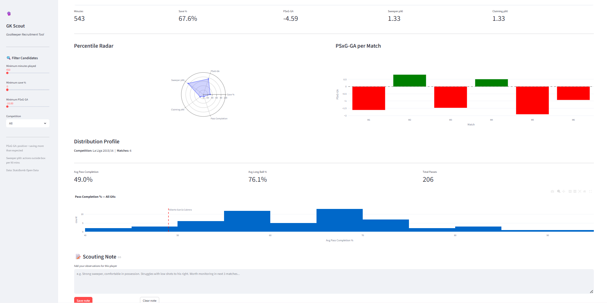

# GK Scout 🧤

A goalkeeper recruitment and profiling dashboard built on StatsBomb open data. Designed to mirror the two-step workflow used by real scouting departments: identify candidates from the market, then deep-dive any individual player with visual evidence.






---

## What it does

**Shortlist view** — filter 55 goalkeepers across 6 competitions by minutes played, save percentage, and PSxG-GA. Sort by any metric and visualise the full candidate pool on an interactive scatter plot.

**Player Profile view** — select any goalkeeper to see a percentile radar across all five metrics, a match-by-match PSxG-GA bar chart, distribution profile, and a free-text scouting note that persists across the session.

---

## Metrics

| Metric | Definition |
|---|---|
| **PSxG-GA** | Post-shot xG minus goals allowed. Positive = saving more than expected. The gold standard GK evaluation metric. |
| **Save %** | Shots saved / shots faced. Normalised; excludes blocked shots. |
| **Sweeper actions p90** | Keeper Sweeper events per 90 minutes. Proxy for how far off the line a GK operates. |
| **Claiming p90** | Collected + Punch events per 90 minutes. Measures aerial command. |
| **Pass completion %** | Completed passes / total passes. Includes long ball % as a stylistic indicator. |

All counting metrics are normalised per 90 minutes. Players with fewer than 450 minutes (5 full matches) are excluded to reduce small-sample noise.

---

## Data

Built on [StatsBomb Open Data](https://github.com/statsbomb/open-data) via `statsbombpy`. No credentials required.

| Competition | Season | Matches |
|---|---|---|
| La Liga | 2015/16 | 380 |
| FA Women's Super League | — | 87 |
| Women's World Cup | 2019 | 52 |
| La Liga | 2014/15 | 38 |
| Premier League | 2003/04 | 38 |
| La Liga | 2013/14 | 31 |

**Coverage note:** StatsBomb open data is a curated sample, not a full league database. Conclusions should be interpreted within this scope. PSxG-GA figures will differ from commercial data providers due to sample size and competition mix.

---

## Project structure

```
gk-scout/
├── app/
│   └── dashboard.py          # Streamlit dashboard
├── data/                     # DuckDB database (not tracked in git)
├── notebooks/
│   ├── 01_explore_statsbomb.ipynb
│   └── 02_build_gk_metrics.ipynb
├── tests/
│   └── test_metrics.py       # 17 unit tests
├── .github/
│   └── workflows/
│       └── ci.yml            # GitHub Actions CI
├── .gitignore
├── requirements.txt
└── README.md
```

---

## Setup

**1 — Clone and create environment:**
```bash
git clone https://github.com/YOUR_USERNAME/gk-scout.git
cd gk-scout
python -m venv venv
venv\Scripts\activate        # Windows
source venv/bin/activate     # Mac/Linux
pip install -r requirements.txt
```

**2 — Build the data pipeline:**

Run notebooks in order:
- `notebooks/01_explore_statsbomb.ipynb` — data exploration
- `notebooks/02_build_gk_metrics.ipynb` — metric aggregation and DuckDB export

This pulls ~626 matches from the StatsBomb API and takes approximately 5 minutes.

**3 — Run the dashboard:**
```bash
cd app
streamlit run dashboard.py
```

**4 — Run tests:**
```bash
pytest tests/ -v
```

---

## Methodology notes

**PSxG vs xG** — This pipeline uses StatsBomb's `shot_statsbomb_xg` field, which is pre-shot xG rather than post-shot xG. True PSxG accounts for shot placement and is available in StatsBomb 360 data (not open access). The metric is still a meaningful improvement over raw save percentage as a GK evaluation tool.

**Minutes played derivation** — Minutes are derived from event timestamps rather than lineup data, as substitution timestamps are not consistently populated in the open data. This introduces minor imprecision for GKs substituted mid-match but does not materially affect per-90 calculations for players meeting the 450-minute threshold.

**Competition mixing** — Players are assigned to their primary competition (most minutes). Cross-competition comparisons should be made with caution; a GK in La Liga faces systematically different shot profiles than one in the FA WSL.

---

## Insights

**PSxG-GA is the headline metric:** Ellie Roebuck (+0.82) and Jan Oblak are the standout outperformers in the dataset

**Sweeper p90 differentiates GK styles clearly:** high sweeper rate (Martínez at 1.78) signals a libero-type GK vs a line-keeper

**Pass completion % alone is misleading without long ball % alongside it:** a GK with 90% completion who never plays long is a very different profile to one with 70% completion and 60% long ball rate

---

## Tech stack

- **Data** — `statsbombpy`, DuckDB, pandas
- **Visualisation** — Plotly, mplsoccer
- **Dashboard** — Streamlit
- **Testing** — pytest (17 tests across save %, PSxG-GA, per-90 normalisation, percentile ranks, data integrity)
- **CI** — GitHub Actions

---

## Possible extensions

- Integrate StatsBomb 360 data for true post-shot xG when available
- Add shot map visualisation showing save locations within the goal frame
- Expand to outfield positions using the same pipeline architecture
- Connect to Wyscout or InStat API for broader competition coverage
